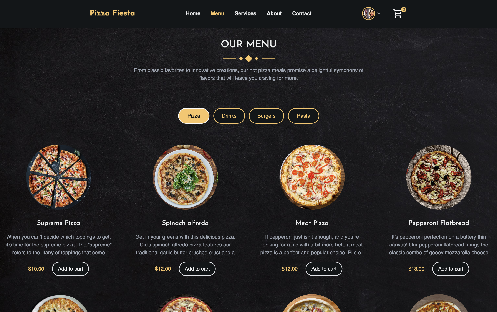

# Pizza Fiesta Website
This is a fullstack food ordering app built with Next.js 14 (React.js, MongoDB, Tailwind CSS).
 

Home page

Menu page

Admin Dashboard

## Features
- User authentication with NextAuth (Email & Google)
- Customizable user profiles
- User-friendly order placement
- Stripe integration for payment processing
- Admin dashboard for restaurant, user, and order management
- EmailJS integration for customer support
- Cloudinary integration for image processing and storage
- Database handling with MongoDB
- UI design with Tailwind CSS & NextUI

## Getting Started

View a demo of this app [here](https://pizza-fiesta.vercel.app/).  
